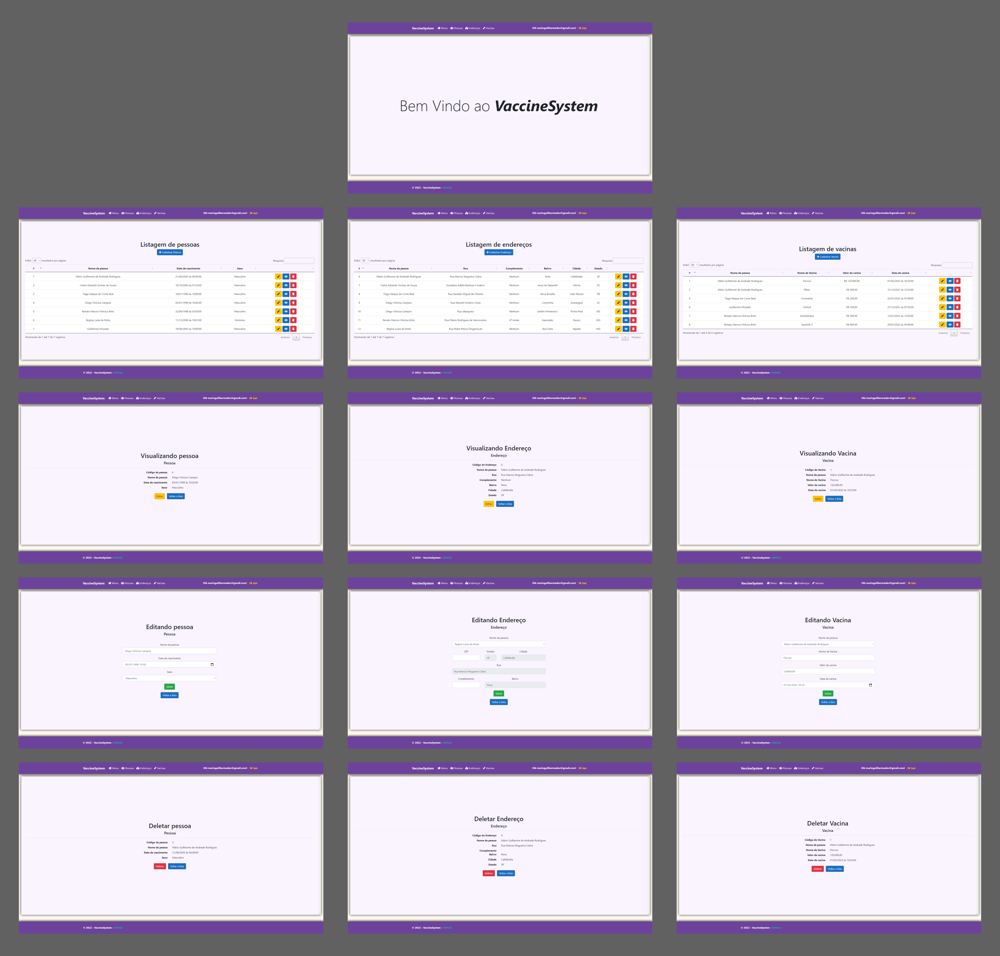

# Vaccine System


## Sobre
Aplicação Web desenvolvida durante o Programa de Estágio do Laboratório Sodré. Com capacidade de realizar as operações básicas de Criar, Visualizar, Editar e Deletar dados das três entidades de Pessoa, Endereço e Vacina.

## Instalação
Passo-a-passo para instalação e configuração do ambiente de desenvolvimento.

Clone o repositório em sua máquina:
```
git clone https://github.com/MarioGuilherme/VaccineSystem
```
Em seguida abra o arquivo `VaccineSystem.csproj` e adeque as propriedades com o seu ambiente, como versão do SDK, pacotes e outros.

## Funcionalidades
- [x] Cadastrar Usuário
- [x] Login de Usuário
- [x] Logout de Usuário
- [X] CRUD de Pessoa
- [X] CRUD de Endereço
- [X] CRUD de Vacina

## Tecnologias
* C# ASP .NET CORE
* ORM Entity Framework
* SQL SERVER
* BootStrap
* HTML
* CSS
* JavaScript

## Bibliotecas
* jQuery
* jQuery Mask
* DataTable
* FontAwesome
* SweetAlert2

## Demonstração
Uploading DEMONSTRACAO.mp4…
